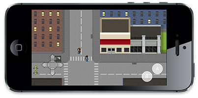
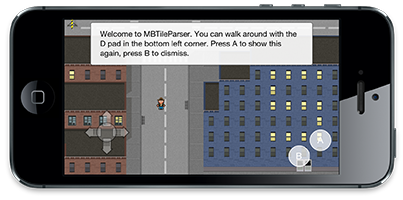

MBTileParser
=============

*Look Ma, a game engine! Running on UIKit!* MBTileParser is a small game engine that supports loading TMX files and TexturePacker files directly into UIKit.

Screenshots & Demo:
---
I've uploaded [a demo video](http://www.youtube.com/watch?v=o88YOnmzj44) to YouTube.

Here's what the game engine looks like in action:

Features:
---

MBTileParser can do five things right now. Load maps, load sprites, display dialog, take input via virtual controls, and retain game state.

 - **Load maps:** MBTileParser is actually the name of a class in the engine. You can load TMX files. Use the `MBMapViewController` class for this.
 - **Load sprites:** You can load sprites using `MBSpriteView`. `MBMovableSpriteView` supports movement too.
 - **Display Dialog:** Load and parse dialog trees, using `MBDialogTree`. (Support for end actions is now implemented.)
 - **Take Input:** Create custom virtual game controls, using the `MBJoystick` and `MBControllerButton` classes. You can also use the included layout.
 - **Manage Games State:** The latest update includes state support (in progress) which allows you to track levels, stamina, score, items, dialog, and more.
 
Setting it Up:
---

Clone into, or download, the repository. Copy the folder called `MBGameEngine` and import `MBGameEngine.h`.

Technical Requirements:
---

MBTileParser requires the iOS 6 SDK and ARC.

To support versions of iOS prior to version 6, you'll need to  replace `NSUUID`, used in the `MBGameState` class.

If you're stuck on Xcode 4.4, you can [hack subscripting support](http://petersteinberger.com/blog/2012/using-subscripting-with-Xcode-4_4-and-iOS-4_3) into Xcode, but I'm not supporting this. Seriously, upgrade Xcode to the latest version.

Even if your project doesn't use ARC, you'll want to compile MBTileParser with ARC. Use the `-fobjc-arc` compiler flag for that.

 
Notes:
---

**About the TMX format, Tiled, and TexturePacker:** The TMX file format is used by Tiled, a tool which helps you make world maps for games by tiling images. (You can download Tiled [here](http://mapeditor.org)). The TMX format is explained in detail on the [tiled GitHub repository wiki](https://github.com/bjorn/tiled/wiki/TMX-Map-Format). The developer of TexturePacker, Andreas Löw, was kind enough to give me a license a while back. Thanks Andreas! You can [get TexturePacker from his website](http://www.codeandweb.com/texturepacker).

**Parting Words:** Please take a moment to star this repository and pass it along to anyone who you think might enjoy it. I also encourage you to look at my other repositories. You might find something you like.

Always have fun, because game engines are fun.

License:
---

MBTileParser is hereby released under the following modified MIT License. 

Copyright (c) 2013 Moshe Berman

Permission is hereby granted, free of charge, to any person obtaining a copy of this software and associated documentation files (the "Software"), with the exception of the sample graphics and audio files, to deal in the Software without restriction, including without limitation the rights to use, copy, modify, merge, publish, distribute, sublicense, and/or sell copies of the Software, and to permit persons to whom the Software is furnished to do so, subject to the following conditions:

The above copyright notice and this permission notice shall be included in all copies or substantial portions of the Software.

THE SOFTWARE IS PROVIDED "AS IS", WITHOUT WARRANTY OF ANY KIND, EXPRESS OR IMPLIED, INCLUDING BUT NOT LIMITED TO THE WARRANTIES OF MERCHANTABILITY, FITNESS FOR A PARTICULAR PURPOSE AND NONINFRINGEMENT. IN NO EVENT SHALL THE AUTHORS OR COPYRIGHT HOLDERS BE LIABLE FOR ANY CLAIM, DAMAGES OR OTHER LIABILITY, WHETHER IN AN ACTION OF CONTRACT, TORT OR OTHERWISE, ARISING FROM, OUT OF OR IN CONNECTION WITH THE SOFTWARE OR THE USE OR OTHER DEALINGS IN THE SOFTWARE.

The "non-code", graphics and audio, may not be used except to build and run the demo on your own machines.

The artwork is copyrighted by [Allan Simpson](http://www.allansimpson.com). He has created it for a project we are working on. You may not use it for anything except to play with the game engine on your own machine(s). Sorry, it's not mine to let you give out. 

Finally, if you make any awesome games with this, please let me know!